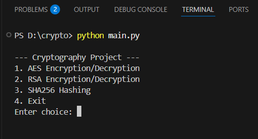
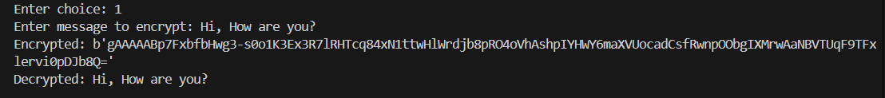
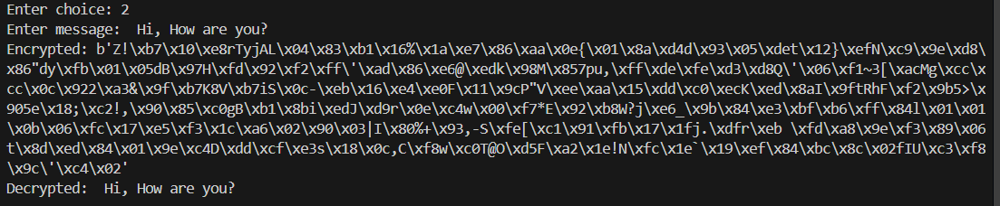
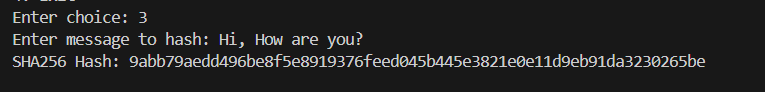

# 🔐 Cryptography Algorithms Implementation (AES, RSA, SHA)

## 📌 Objective

This project implements fundamental cryptographic algorithms including AES (symmetric encryption), RSA (asymmetric encryption), and SHA256 (hashing) to understand secure communication techniques.

---

##  Tools & Technologies

* Python
* Cryptography Library
* hashlib
* OpenSSL (for key generation)

---

##  Features

* AES Encryption & Decryption
* RSA Public/Private Key Encryption
* SHA256 Hashing

---

##  Project Structure

```
cryptography-project/
│
├── screenshots
├── aes.py
├── rsa.py
├── sha.py
├── main.py
├── requirements.txt
└── README.md
```

---

## ⚙️ Installation & Setup

### 1. Clone the repository

```
https://github.com/Khampa08/Cryptography_implementation.git
cd Cryptography_implementation
```

### 2. Install dependencies

```
pip install -r requirements.txt
```

### 3. Run the project

```
python main.py
```

---

##  Sample Output

* AES encryption and decryption of messages
* RSA secure communication using public/private keys
* SHA256 hashing of input messages

---
## 📸 Screenshots

### 🔹 Main Menu



### 🔹 AES Encryption/Decryption



### 🔹 RSA Encryption/Decryption



### 🔹 SHA256 Hashing



## OpenSSL Commands (Optional)

```
openssl genrsa -out private.pem 2048
openssl rsa -in private.pem -pubout -out public.pem
```

---

##  Learning Outcomes

* Understanding symmetric and asymmetric encryption
* Basics of cryptographic hashing
* Secure communication techniques

---

## 👨‍💻 Author

Khampa Basumatary

---

## 📌 Note

This project is developed for educational purposes to demonstrate cryptographic concepts.
